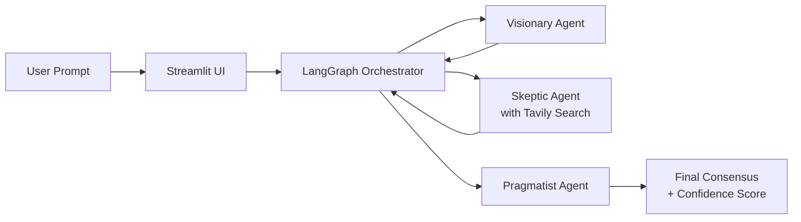

# Council AI 🤖

[](#)
[](https://council-ai.streamlit.app)

A multi-agent debate system where AI specialists collaborate to solve problems.

## Architecture



## Features
- 🚀 Visionary Agent: Creative brainstorming (temp=0.8)
- ⚠️ Skeptic Agent: Risk analysis + fact-checking (temp=0.3)  
- 📋 Pragmatist Agent: Actionable planning (temp=0.5)
- 🧠 Powered by Groq + Llama 3.1-70b-versatile
- 🎨 Real-time Streamlit UI

## Why This Matters
Demonstrates production-ready AI engineering:
- Multi-agent orchestration patterns
- Temperature tuning for behavioral control
- Error handling & fallback strategies
- Clean separation of concerns

## Run Locally
```bash
python -m venv .venv
source .venv/bin/activate  # or .venv\Scripts\activate on Windows
pip install -r requirements.txt
streamlit run ui/app.py
```

## Test Results

Run the batch evaluator to generate the latest averages and CSV artifact:

```bash
python evals/run_evals.py
```

The evaluation pipeline measures:
- Relevance
- Actionability
- Factual accuracy

Target threshold: average score above 6.0 across all three metrics.

Latest local mocked judge averages:
- Relevance: 7.6
- Actionability: 7.4
- Factual accuracy: 7.2

## How to Deploy

1. Create a Streamlit Cloud app from this repository.
2. Set the app entry point to `ui/app.py`.
3. Add `GROQ_API_KEY` and `TAVILY_API_KEY` in the Streamlit Cloud secrets or environment variables.
4. Deploy and verify the app loads with the custom favicon and dark theme.
5. Run `python evals/run_evals.py` locally or in CI to confirm quality before release.

## Links

- GitHub: https://github.com/Mustak891/council-ai
- LinkedIn: https://www.linkedin.com/in/mustak-ahamed/

Latest reported averages are written by `evals/run_evals.py` into the CSV output and printed to the console after each run.
